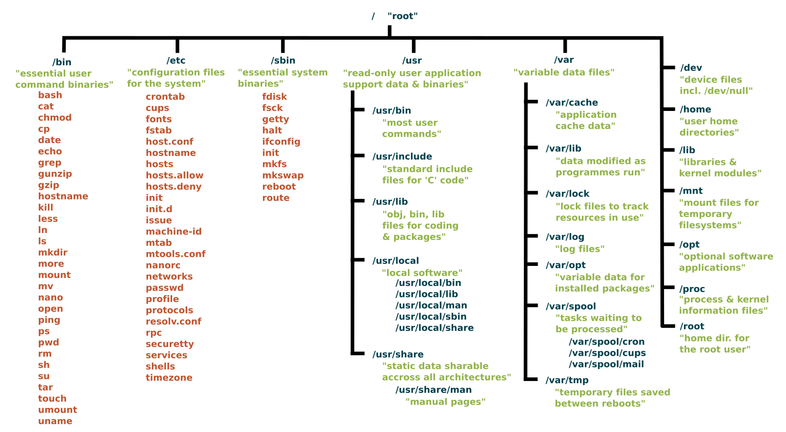
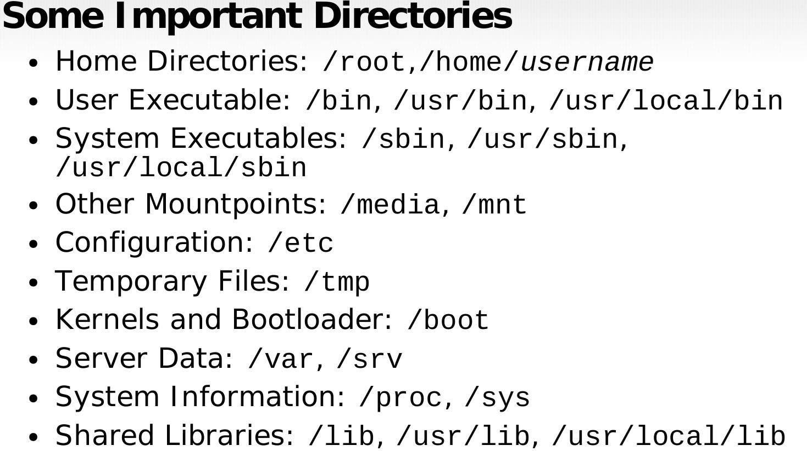

# Introduction

## What is Linux?
Linux is an **open-source operating system (OS)** used in devices like smartphones, supercomputers, home appliances, and enterprise servers. It manages hardware and software resources, providing a platform to run applications.

**Key Features:**
- Free and open-source
- Secure and stable
- Highly customizable
- Widely used in servers and DevOps

**First Release:** September 17, 1991 by Linus Torvalds

---

## What is Open-Source?
Open-source means the **source code is freely available** to anyone. It allows:
- Freedom to use the software for any purpose
- Freedom to study and modify it
- Freedom to redistribute it
- Freedom to create new versions

---

## Why Use Linux?
- **Free & Open-source**
- **Community Support**
- **Customizable OS**
- **Great for Servers & DevOps**
- **Secure and Stable**
- **Best for Automation & Scripting**

---

## Linux Architecture

### Main Components:
1. **Hardware** – CPU, memory, input/output devices
2. **Kernel** – Core part; manages hardware, processes, memory
3. **Shell** – Interface between user and kernel
4. **Applications & Commands** – Tools like `vi`, `cd`, `grep`, etc.
5. **Users** – Multiple users can operate the system via shell

**Summary:**
Users interact with applications and commands → shell → kernel → hardware.

---

## What is the Kernel?
The **kernel** is the heart of Linux. It controls hardware access and resource allocation.

A full Linux system includes:
- Kernel
- GNU utilities & libraries
- Scripts for management and installation

---

## What is a Linux Distribution (Distro)?
A **distro** is a version of Linux with the kernel + additional software and package manager.

### Examples:
- **Ubuntu**
- **Fedora**
- **Debian**
- **Kali Linux**

---

## History of Linux
Created in **1991** by **Linus Torvalds** as a free alternative to UNIX. Its popularity grew due to:
- Reliability
- Cost-effectiveness
- Flexibility

**Used in:** Computers, phones, smart gadgets, TVs, etc.

---

## Common Linux Distros in IT

### RPM-based:
- Red Hat Enterprise Linux (RHEL)
- CentOS
- Oracle Linux

### Debian-based:
- Ubuntu Server
- Kali Linux

### Desktop Distros:
- Ubuntu Linux
- Linux Mint
- Fedora
- Arch Linux
- Debian
- OpenSUSE

### Server Distros:
- RHEL
- Ubuntu Server
- CentOS
- SUSE Enterprise Linux

---

## Special Characters in Linux

| Symbol | Name        | Description                                |
|--------|-------------|--------------------------------------------|
| `~`    | Tilde       | Home directory                             |
| `*`    | Star        | Matches any characters                     |
| `?`    | Question    | Matches any single character               |
| `&`    | Ampersand   | Runs job in background                     |
| `#`    | Hash        | Used for comments                         |
| `%`    | Percentage  | Wildcard (matches anything including ext) |
| `/`    | Slash       | Root directory                             |

---

---

## Difference: RPM vs DEB Packages

Both are installation formats:
- **DEB**: For Debian-based systems (e.g., Ubuntu)
  - Tool: `dpkg`
  - Example: `google-chrome-stable_current_amd64.deb`
  - Install: `sudo dpkg -i package.deb`

- **RPM**: For Red Hat-based systems (e.g., RHEL, CentOS)
  - Tool: `rpm`
  - Example: `google-chrome-stable-57.0.2987.133-1.x86_64.rpm`
  - Install: `sudo rpm -ivh package.rpm`

**Note:** Different commands and service names are used across distros.

---