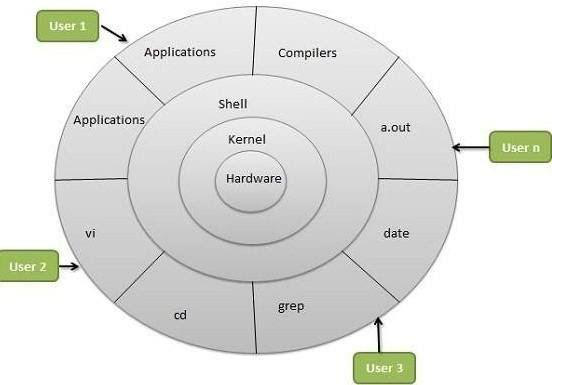

# Linux

## What is Linux?
Linux is an open-source operating system (OS) that powers a wide range of devices, including smart cars, Android devices, supercomputers, home appliances, enterprise servers, and more. In simple terms, an operating system is software that brings a machine to life by managing its hardware and resources.

Linux is known for its flexibility, security, and community-driven development. It allows users to control every aspect of the system, modify source code, and install only the required software. The first version of Linux was released on September 17, 1991.

## What Does Open-Source Mean?
Open-source software is software whose source code is freely available to the public. The Free Software Foundation defines open-source freedoms as:

- The freedom to run the program for any purpose.
- The freedom to study and modify the source code.
- The freedom to redistribute the program.
- The freedom to create derivative programs.

## Why Use Linux?
Linux is widely used due to several advantages:

- **Open-Source:** Free to use and modify.
- **Community Support:** A large global community provides support and improvements.
- **Highly Customizable:** Users can tailor the OS to their needs.
- **Server Usage:** Most enterprise servers run on Linux.
- **DevOps Integration:** Many DevOps tools are designed to work with Linux.
- **Automation:** Linux is widely used for scripting and automation tasks.
- **Security:** Known for its strong security and stability.

# Linux Architecture

## Components of Linux Architecture

1. **Hardware**  
   - The core of the system, including CPU, memory, and input/output devices.

2. **Kernel**  
   - The heart of Linux, managing hardware resources, process scheduling, and system calls.

3. **Shell**  
   - Acts as an interface between the user and the kernel.
   - Interprets user commands and executes them.

4. **Applications & Commands**  
   - Applications: Software like text editors, compilers, and utilities.
   - Commands: Examples include `vi`, `cd`, `grep`, `date`, and `a.out`.

5. **Users**  
   - Multiple users (User 1, User 2, User 3, ..., User n) interact with the system through the shell.

## Summary
The Linux architecture follows a layered structure where users interact with applications and commands, which communicate with the shell. The shell, in turn, interacts with the kernel, which manages the hardware.

---

## What is the Kernel?  
The **kernel** is the core program of the operating system that has complete control over the system.  
Its job is to manage communication between **hardware** and **software** to allocate resources for tasks.  
A complete Linux system consists of:  
- **Kernel**  
- **GNU system utilities & libraries**  
- **Management scripts & installation scripts**  

## What is a Linux Distribution?  
A **Linux distribution (distro)** is a version of Linux that includes the Linux kernel and additional software.  
Popular distributions include:  
- **Ubuntu**  
- **Fedora**  
- **Kali Linux**  
- **Debian**  

---

# History of Linux  
In **1991**, Linus Torvalds, a student from Finland, created Linux as an alternative to **UNIX**.  
He released it for free, and developers worldwide contributed to improving it.  
Over time, Linux gained popularity due to its **reliability, low cost, and flexibility**.  
Today, Linux runs on devices such as:  
- Computers  
- Smartphones  
- TVs  
- Smart gadgets  

---

# Most Used Linux Distros in IT Industry  
### RPM-based:  
- **RHEL** (Red Hat Enterprise Linux)  
- **CentOS**  
- **Oracle Linux**  

### Debian-based:  
- **Ubuntu Server**  
- **Kali Linux**  

## Different Linux Distributions  

### Popular Desktop Linux OS  
- **Ubuntu Linux**  
- **Linux Mint**  
- **Arch Linux**  
- **Fedora**  
- **Debian**  
- **OpenSUSE**  

### Popular Server Linux OS  
- **Red Hat Enterprise Linux (RHEL)**  
- **Ubuntu Server**  
- **CentOS**  
- **SUSE Enterprise Linux**  

---

# Special Character Meanings in Linux  

| Symbol | Name | Description |
|--------|------|------------|
| `~` | Tilde | Indicates Home Directory |
| `*` | Star | Wildcard Matches Anything |
| `?` | Question mark | Wildcard Matches any character |
| `&` | Ampersand | Run a job in background and redirect error |
| `#` | Hash | Used for commenting in configuration files and scripts |
| `%` | Percentage | Wildcard Matches Anything including extensions |
| `/` | Forward Slash | Indicates Root Directory |

---

